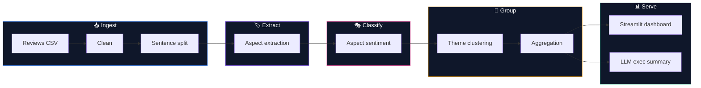

<div align="center">

# 🔍 ReviewLens

### **Aspect-Based Review Intelligence**

##### *Stop scoring reviews. Start understanding them.*

<p>
  
  
  
  
  
</p>

<p>
  
  
  
  
</p>

</div>

---

<div align="center">

### Here is a **2-star** review.

> ### *"The display is stunning **but the battery is a dealbreaker**. Also the price keeps going up while quality stays the same."*

### Document-level sentiment scores it **`positive (+0.20)`**.

</div>

> [!WARNING]
> That is not a bug in the sentiment model — it's the ceiling of the whole approach.
> One score per review averages "stunning display" against "battery dealbreaker"
> and lands on a number that is **worse than useless**: it's confidently wrong.

**ReviewLens reads it the way a human does — one opinion per aspect:**

<div align="center">

| | 🖥️ display | 🔋 battery |
|:--|:--:|:--:|
| **Document-level VADER** | `positive +0.20` | `positive +0.20` ❌ |
| **Per-aspect VADER** *(baseline)* | `positive +0.20` | `positive +0.20` ❌ |
| **🏆 Transformer ABSA** | `positive +0.997` ✅ | **`negative −0.970`** ✅ |

</div>

Only the cross-encoder — which reads the sentence **and the aspect together** — holds
two opposite opinions inside one sentence. That gap *is* the project.

> [!NOTE]
> **12 of 18** reviews in the sample carry mixed per-aspect sentiment. A single score
> silently flattens every one of them.

<br>

## 🧬 The pipeline



Every stage ships a **fast baseline** first, then upgrades to a **transformer**:

| Stage | 🥉 Baseline (offline, seconds) | 🥇 Upgrade | Status |
|:--|:--|:--|:--:|
| **Aspect extraction** | Noun-phrase chunking (NLTK POS + grammar) | Fine-tuned **BIO** token classifier | 🔜 |
| **Aspect sentiment** | VADER on the aspect's sentence | **`deberta-v3-base-absa`** cross-encoder | ✅ |
| **Theme clustering** | Keyword + normalization grouping | **MiniLM** embeddings → KMeans / HDBSCAN | 🔜 |
| **Summary** | Top loved / hated ranking | **LLM** executive summary | 🔜 |

> Baselines aren't throwaway scaffolding — they're the **benchmark**. Every upgrade has
> to beat a number, not a vibe.

<br>

## 📊 Baseline vs. transformer — measured, not claimed

Same 18 reviews, same aspects, only the sentiment model swapped
(`--aspect-model baseline` vs `--aspect-model absa`). Net score is
`(positive − negative) / mentions`, in `[-1, +1]`:

| Theme | 🥉 VADER | 🥇 ABSA | What the reviews actually say |
|:--|:--:|:--:|:--|
| 📞 **call** | `+1.00` | **`−1.00`** | *"they keep disconnecting during calls"*, *"microphone quality on calls is poor"* — the baseline was **100% inverted** |
| 💰 **price** | `+0.20` | **`−0.60`** | *"Disappointed for the price"*, *"the price is steep"* |
| 🎧 **service** | `−0.50` | **`−1.00`** | *"support ignored my emails"*, *"warranty process is a nightmare"* |
| 🔋 **battery** | `+0.50` | **`+0.12`** | genuinely split — praised on the watch, hated on the phone |

VADER inverts `call` because it scores whole sentences: *"Comfortable fit but they keep
disconnecting during calls"* reads as net-positive, so **every** aspect in it — including
the complaint — inherits `positive`.

<br>

## ⚡ Quickstart

```bash
git clone https://github.com/SaudSatopay/review-lens.git
cd review-lens
python -m venv .venv && source .venv/bin/activate   # Windows: .venv\Scripts\activate
```

<details open>
<summary><b>🥉 Baseline — no torch, installs and runs in seconds</b></summary>

```bash
pip install -r requirements-core.txt
pip install -e .
python -c "from reviewlens.nltk_setup import ensure_nltk_data; ensure_nltk_data()"

python scripts/run_pipeline.py --group-by theme   # CLI report
streamlit run app/streamlit_app.py                # 📊 dashboard
```

</details>

<details>
<summary><b>🥇 Transformer ABSA — real (sentence, aspect) → polarity</b></summary>

```bash
pip install -e ".[ml]"                            # + torch, transformers

python scripts/run_pipeline.py --aspect-model absa --group-by theme
```

First run downloads `yangheng/deberta-v3-base-absa-v1.1` (~370 MB). Runs on CPU;
uses CUDA automatically when available. Or set it permanently in `config.yaml`:

```yaml
sentiment:
  aspect_model: absa
```

</details>

<br>

## 🖥️ What you get

```console
$ python scripts/run_pipeline.py --aspect-model absa --group-by theme

=== ReviewLens pipeline (absa) ===
Reviews processed : 18
Sentences         : 42
Aspect mentions   : 75

-- Top loved (theme) --
  comfort            net=+1.00  (n=3)
  camera             net=+1.00  (n=3)
  screen             net=+0.67  (n=6)
  delivery           net=+0.50  (n=4)
  sound              net=+0.43  (n=7)

-- Top hated (theme) --
  service            net=-1.00  (n=4)
  call               net=-1.00  (n=2)
  price              net=-0.60  (n=5)

12 review(s) contain mixed per-aspect sentiment that a single
document-level VADER score would flatten.
```

The dashboard turns that into per-aspect stacked sentiment bars, a net-score ranking,
sentiment-over-time, representative quotes, and product/rating filters.

<br>

## 🗂️ Project structure

```
review-lens/
│
├── 📦 src/reviewlens/
│   ├── config.py               # loads config.yaml — single source of truth
│   ├── nltk_setup.py           # one-shot NLTK corpora bootstrap
│   ├── data/                   # ingest · clean · sentence-split
│   ├── aspects/                # noun-phrase baseline · BIO tagger (next)
│   ├── sentiment/              # VADER baseline · transformer ABSA cross-encoder
│   ├── clustering/             # theme grouping · MiniLM embeddings (next)
│   ├── aggregate/              # distributions · rankings · quotes · trends
│   └── pipeline.py             # end-to-end orchestration + CLI
│
├── 📊 app/streamlit_app.py     # the dashboard
├── 🔧 scripts/run_pipeline.py  # CLI (no install needed)
├── 📓 notebooks/               # exploration
├── ✅ tests/                   # 40 tests
├── 🗃️ data/sample/             # tiny sample — pipeline runs out of the box
└── ⚙️ config.yaml              # paths · models · thresholds
```

<br>

## ✅ Tests

```bash
pytest                                        # 38 tests, ~0.5s (no model download)
REVIEWLENS_RUN_MODEL_TESTS=1 pytest           # + 2 tests that exercise the ABSA checkpoint
```

Model-dependent tests are opt-in by design — a default `pytest` should never pull
370 MB of weights.

<br>

## 📏 Evaluation

Planned against **SemEval-2014 Task 4** (Restaurants + Laptops), the standard ABSA benchmark.

| What | Metric | Compared against |
|:--|:--|:--|
| Aspect extraction | Span-level **F1** (`seqeval`) | Noun-phrase baseline |
| Aspect sentiment | **Macro-F1** | VADER-on-sentence baseline |
| End-to-end value | Mixed-review recovery rate | Document-level VADER |

<br>

## 🗺️ Roadmap

- [x] **Slice 0 — Scaffold + runnable baseline** · ingest → aspects → sentiment → themes → dashboard → tests
- [x] **Slice 1 — Transformer ABSA** · `deberta-v3-base-absa` cross-encoder, swappable via config/CLI
- [ ] **Slice 2 — Evaluation harness** · SemEval-2014, extraction F1 + sentiment macro-F1
- [ ] **Slice 3 — Fine-tuning** · train the BIO aspect tagger + ABSA classifier
- [ ] **Slice 4 — Embedding clustering** · MiniLM + KMeans/HDBSCAN theme discovery
- [ ] **Slice 5 — LLM executive summary** · optional, Ollama or API
- [ ] **Slice 6 — Real Amazon/Yelp demo** + polish

<br>

## 🛠️ Built with

<div align="center">

`Python` · `PyTorch` · `HuggingFace Transformers` · `sentence-transformers`
`scikit-learn` · `NLTK` · `VADER` · `pandas` · `Streamlit` · `Plotly` · `pytest` · `ruff`

</div>

<br>

---

<div align="center">

**[MIT](LICENSE)** © 2026 **Saud Satopay**

*Final-year AI & Data Science NLP mini-project*

</div>
